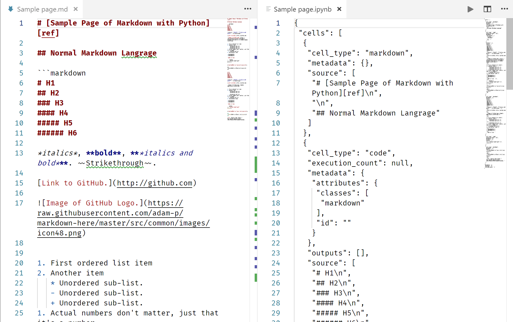

# 常用 Markdown 工具的介紹與 jupyter 的整合

[TOC]

## 有關 Markdown


### 特色

1. 輕量易讀，幾乎零學習：基礎語法源自純文字 e-mail。

   

   同樣的內容用 markdown 與 Jupyter notebook 呈現的差異

2. 應用廣泛：

   你在哪裡可以用 markdown：

   - 幾乎所有編輯器(editor)。
   - 許多為 markdown 打造的寫作、筆記、個人知識庫軟體或服務。
   - 與程式語言的整合：Jupyter notebook、Rmarkdown。

3. 自由：幾乎所有編輯器、IDE 都支持 markdown，就算不支持，只要這個軟體能打字你也能寫出人人看得懂的 Markdown 文件。

   更多語法可參考：https://markdown.tw/、[Markdown Cheatsheet 中文版](https://gist.github.com/billy3321/1001749662c370887c63bb30f26c9e6e#file-markdown-cheatsheet-md)

### 使用 markdown 需要注意的事

1. 你用的是哪個版本的語法？Markdown？ [Github-flavored Markdown (GFM)](http://github.github.com/github-flavored-markdown/)？markdown extra？
2. 注意文字縮排與換行規則。
3. 相關軟體通常比較難安裝。

## markdown 工具介紹

### 文本撰寫工具 - [Typora](https://typora.io/)

<video width="500" src="https://typora.io/img/beta.mp4" autoplay >

- 用途：草稿寫作、筆記整理、文本管理。
- 主功能：一個所見即所指(What You See Is What You Mean)的即食預覽 markdown 書寫程式。
- 優缺點：
  1. Win、Mac OS、Linux 版都有、目前還是免費軟體，但仍在 beta 期中。
  2. 把語法弄得像快捷鍵，可以類似 Word 的感覺寫作。
  3. 筆記相關功能較為薄弱：無雲端同步、Tag 分類等功能。
- 替代軟體：
  - 離線筆記軟體：[Bear](https://bear.app/)(專注於筆記，可同步不同裝置，但僅限蘋果裝置，Freemium)、[inkdrop](https://inkdrop.app/)(支援多系統，類似Bear，全付費訂閱制)、[Boostnote](https://boostnote.io/)(編輯器比較經典，筆記功能完整，另外提供程式碼整合，GPL v3)
  - 主流的編輯器：VS Code、Atom、Sublime Text、Vim、Emacs、notepad++ 等...幾乎都有 markdown 外掛。
  - 寫作軟體：族繁不及備載(ulysses、iA Writer 等)

### 線上協作工具 - [HackMD](https://hackmd.io/)


- 用途：文件分享、協作討論(共筆)
- 主功能：一個網站可以撰寫、分享、公開 markdown 文件，可以簡報、電子書方式呈現，並支援他人批註討論。
- 優缺點：
  1. 編輯器算好用，有些特殊的指令可以快速新增連結過去的 markdown 文件。
  2. 書本模式、簡報模式可以更好應用文件。
  3. 官方手冊本身就是放在該系統下的 markdown 文件，可以直觀的學習怎麼應用 markdown。
  4. 當作討論版使用不若 Slack、Line、Facebook 等直觀，雖然文件本身可以使用 $\LaTeX$ 數學式，但討論介面無法使用 $\LaTeX$。
  5. 沒有離線版...
- 替代軟體：
  - [StackEdit](https://stackedit.io/)、[Markdown Plus](https://mdp.tylingsoft.com/)：純編輯器。
  - [GitBook](https://www.gitbook.com/)：書本分享為主，整合 Git 工具。

### 報告幫手 - R Markdown

Rstudio 內建的記事本介面，可以利用 YAML 設定輸出方式，可以利用其彙整圖文多媒體內容、程式碼、程式碼執行結果(基本支援 R 跟 Python)，礙於篇幅不多作介紹，僅提供相關資源：

- [R Markdown 的網路教學 (Google 搜尋結果)](https://www.google.com/search?client=firefox-b-d&q=Rmarkdown+%E6%95%99%E5%AD%B8)
- [R Markdown: The Definitive Guide (R Markdown 開發者自撰教學手冊)](https://bookdown.org/yihui/rmarkdown/)
- [吾人拙作宣傳：快速上手數學報告](https://hackmd.io/c/HyJ0JKdhX/%2F9hzXJIapTgaHYUX7iPYZJQ)

## 利用 notedown 在 Jupyter 中整合 markdown

[notedown][https://github.com/aaren/notedown] 是一個 python package 用來橋接 markdown 文件與 Jupyter 的 `.ipynb` 文件，對我們最重要的功能就是在 Jupyter 下可以直接把 `.md` 讀入成  `.ipynb` 文件，在安裝 notedown 之前我們在 Jupyter 打開 `.md` 檔會是這樣的：


### 安裝 [notedown](http://github.com/aaren/notedown) 並設定

1. 在終端機內以下列指令安裝

   ```bash
   pip install notedown
   ```

2. 生成 Jupyter 設定

   ```bash
   jupyter notebook --generate-config
   ```

   執行完會在資料夾生成 Jupyter 設定檔

   

3. 去輸出的路徑尋找 `jupyter_notebook_config.py` 檔案，並在檔案最後加入下列指令：

   ```
   c.NotebookApp.contents_manager_class = 'notedown.NotedownContentsManager'
   ```

   

現在安裝完成後，再用 Jupyter 開啟 `.md` 檔會是這樣：

