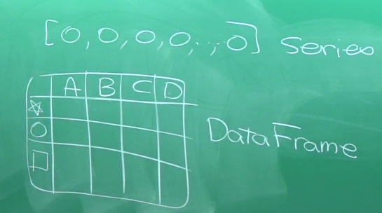

# 20190315 Python AI Math

[TOC]

## 04-01 用電腦來學習

> 老師說上次作業同學有趣題目都不夠詳細 (要說明大致會需要從哪裡得到那些資料、大致需要如何處理或分析資料、然後要如何有結果)

兩個用用電腦學習的範例：

- [Allen Downey 免費的書下載](https://greenteapress.com/wp/)
- [Mosky：Hypothesis Testing with Python](https://github.com/moskytw/hypothesis-testing-with-python)

 

## 04-02 進入 array 導向的程式設計 

數據分析最重要的概念, 大概是「==不到最後關頭, 絕不輕言使用迴圈==」。

傳統用迴圈處理同學加分公式 $11\cdot grade+4$

```python
grades = [35, 74, 43, 66, 87, 55, 71, 65]
curved = []
curved2 = []

for g in grades:
    curved.append(g * 1.1)

for c in curved:
    curved2.append(c + 4)
```

 換成 array 是：

```python
%matplotlib inline

import matplotlib.pyplot as plt
import numpy as np
import pandas as pd

# 以 np.array 將資料 array 化
grad_arr = np.array(grades)
grad_arr * 11 + 4 # == np.array(curved2)
```

 這個就叫 broadcasting (一個一個輸入到每一個裡面去)


 

## 04-03 Broadcasting 比我們想像更有趣

同 dim 相乘就是點乘

```python
array1 = np.array([a1, a2, a3])
array2 = np.array([b1, b2, b3])

array1 * array2 # 會給出 array([a1*b1, a2*b2, a3*b3])
(array1 * array2).sum() # 調用 array 內的加總函數
```

@ 是 dot product (矩陣乘法)

 ```python
array1 @ array2 # == (array1 * array2).sum()
 ```

### 二階 array

就是矩陣 (以 m\*n 的矩陣為例)：

```python
np.array([[a11, a12, ..., a1n],
          [a21, a22, ..., a2n],
          ...,
          [am1, am2, ..., amn]])
```

若一階點乘二階會自動補齊

#### array.sum(axis=dim)


- 加上 axis 會變成同該 dim 的會被加總 (==故 0 是同 column 加總，1是同 row 加總==)

- .sum ==會讓形狀跑掉，請用 .reshape(n,m)== 修回來

- 一個二階 array 跟一個一階 array 做運算 (如 +, \*, @)，==因為 broadcasting 的作用，會把高階的那個拆成多個低階的跟低階的並行運算==

  


 

## 04-04 重要的 array 大變身

如何調整？用亂數做出 50 個數字的 array, 叫做 A 教學。

```python
A = np.random.randint(0,10,50) # 可以用把 50 改成 (5,10) 直接指定 shape
A.shape # 檢查 shape
A.shape = (5,10) # 這是直接改元物件 A 的形狀
A.reshape(10,5) # 這是輸出重改形狀的 array (元物件 A 形狀不變) 
```

推薦使用 `reshape` 

### .ravel() ：拉直

```python
A.ravel()
```

### 快速 array 生成法

```python
np.zeros(shape) # 全0
np.eye(shape) # 斜對角是1其餘0
np.ones(shape) # 全是1
np.diag((a1, a2, a3, ..., an)) # 以(a1, a2, a3, ..., an)為斜對角的矩陣
np.diag(二階 Array) # 取斜對角作為向量
```

## 04-05 array 過濾器

用 T/F 值 array

```python
array[TFarray] 
```

 會回傳 T 的元素，故可以用邏輯判斷運算製造 T/F 值 array 然後挑出你想要特徵的資料

```python
L[L>0] # 回傳 L 當中大於 0 的值
```

[Ex] 標出函數正值處(在圖上面)

```python
x = np.linspace(-5, 5, 1000)
y = np.sinc(x)

plt.plot(x,y,lw=6)
plt.plot(x[y>0] , y[y>0], 'o')
```

## 04-06 引入符號運算

套件 sympy

```python
import sympy as sym

1/2 + 1/3 # 一般計算
sym.Rational(1, 2) + sym.Rational(1, 3) # 輸出分數形式
sym.init_printing() # 輸出接近 LaTeX
sym.Rational(1, 2) + sym.Rational(1, 3) # 再算一次結果會不同
π = sym.pi
N(π, 20)
```

 更方便的做法 -- sympify

```python
sym.S(1)/2 + sym.S(1)/3 # 基本的 sympify 指令

from sympy import S, N
S(1)/2 + S(1)/3
```

 $\pi$ day 紀念 - 什麼都在 π 中出現過...

```python
pistring = str(N(π, 100000))
'1215' in pistring
'9487' in pistring
pistring.find('1215')
pistring[11942:11946]
```

## 04-07 質數 

```python
sym.isprime(a) # 是否為質數
sym.factorint(9487) # 質因數分解
sym.prime(87) # 第幾個質數
sym.nextprime(449) # 下一個質數
```

 孿生質數(兩個相減差2的質數)

```python
for i in range(2, 50):
    a = sym.prime(i)
    b = sym.prime(i+1)
    if b-a == 2:
        print(f'{a} 和 {b} 是孿生質數!')
```

## 04-08 Sympy 的矩陣

sym.Matrix()


```python
A = sym.Matrix([[2, -1, 3],
                [0, 1, 2],
                [-1, 1, 2]])
                
A.det() # 行列式
A.inv() # 反矩陣
```

## 04-09 設定 Sympy 的變數

 sym.Symbol('x')

```python
x = sym.Symbol('x') # 設 x 為變數
f = x**2 - 3*x + 2
g = 5*x**2 - 3*x + 9
f + g
h = 3*k**2 - 3*k + 2 # 這會 error(因為 k 還沒有被符號化)

sym.diff(f, x) # 微分
sym.integrate(f, x) # 積分

from sympy.abc import x, y, z
```

## Pandas 簡介

pandas 資料形式介紹



```python
import pandas as pd
df = pd.read_csv('http://stats.moe.gov.tw/files/detail/107/107_student.csv')
df.obj == df["obj"]
```

# TA

## plt

```python
import matplotlib as plt

plt.figure(figsize=(x,y)) # 大小
plt.xkcd() #風格
plt.plot(x, y, label='str') # 標籤圖片
plt.xlabel('str'); plt.ylabel('str') # 軸標籤
plt.xlim(xmin, xmax); plt.ylim(ymin, ymax); # 軸範圍
plt.xticks(x_array); plt.yticks(y_array) # 軸刻度

np.arange
```

## Zip & Enumerate & Map & Lambda

### zip

```python
# 鍵與值的資料
keys = ["tw", "us", "it"]
values = [2.1, 3.8, 6.9]
# 建立 Dict
z = zip(keys, values) # type is zip
l = list(zip(keys, values)) # type is list (have order)
d = dict(zip(keys, values)) # type is dict (no order)
```

zip() in conjunction with the \*operator can be used to unzip a list

```python
baz = ((1, 2), (3, 4), (5, 6), (7, 8))
rex, blah = zip(*baz)
```

所以我們可以導出下面的規則：令 `a` 與 `b` 各為一 tuple，且 `b = zip(*a)`，則 `a[i][j] == b[j][i]`，其中 `i` 與 `j` 為整數， `i <= len(a)`，且對於 `0 <= i < len(a)`，`j <= len(a[i])`。

如果你把 `a` 與 `b` 想成矩陣，事實上這個運算就等同於轉置（transpose）的效果。在一開始的那個例子（一般的使用狀況）中，`a` 即為 `((1, 2, 3, 4), (5, 6, 7, 8))`，其轉置為 `((1, 5), (2, 6), (3, 7), (4, 8))`，拿來 iterate 後就會得到上面的結果。回憶高中數學，若 *A* 為矩陣，則

$$
(A^T)^T=A
$$

所以當然 `zip` 會是自己的 inverse！

###  `*`-operator to unpack the arguments

The reverse situation occurs when the arguments are already in a list or tuple but need to be unpacked for a function call requiring separate positional arguments. For instance, the built-in [`range()`](https://docs.python.org/3/library/stdtypes.html#range) function expects separate *start* and *stop* arguments. If they are not available separately, write the function call with the `*`-operator to unpack the arguments out of a list or tuple:

```python
>>> list(range(3, 6))            # normal call with separate arguments
[3, 4, 5]
>>> args = [3, 6]
>>> list(range(*args))            # call with arguments unpacked from a list
[3, 4, 5]
```

In the same fashion, dictionaries can deliver keyword arguments with the `**`-operator:

```python
>>> def parrot(voltage, state='a stiff', action='voom'):
...     print("-- This parrot wouldn't", action, end=' ')
...     print("if you put", voltage, "volts through it.", end=' ')
...     print("E's", state, "!")
...
>>> d = {"voltage": "four million", "state": "bleedin' demised", "action": "VOOM"}
>>> parrot(**d)
-- This parrot wouldn't VOOM if you put four million volts through it. E's bleedin' demised !
```

#### Variable Length Function Arguments

用 `*`-operator 來代表多重輸入

```python
def f(*args):
    for i in args:
        print(i)
    return

f('a')
f('a', 'b')
f('a', 'b', 'c')
```

同理 `def function(var1, var2, *other_vars):` 就可以在輸入不固定長度的輸入(先暫時把後面的東西當 list 使用，但注意 `def function(*other_vars, var1):` 這樣定義，所有的輸入只要沒指定對象都會被 `*other_vars` 吸掉導致 `var1` 沒輸入(可用`=`指定)。

#### Variable Length Keyword Arguments

```python
def f(**args):
    for i,j in args.item:
        print(f'{i}, {j}')
    return
```

`**` 會變成字典檔，會對應關鍵字找輸出 (例如你有指定 arg1 在函數中，字典檔不需要照順序輸入會幫你對到該輸入)

### Enumerate 列舉

會編號並輸出元素，可用於快速字典化某資料(以編號來索引)

```python
e = enumerate(keys) # type is enumerate
l = list(enumerate(keys)) # type is list (list name is number)
d = dict(enumerate(keys)) # type is dict

enumerate(keys, index) # 給出編號起始值
```

### Map & lambda

`map(函數, 資料)` 會把資料分開帶入函數運算。

`lambda 變數: 單行內可敘述的該變數函數` 為無名單行自定義函數，若某些函數的變數有函數並且我們不想花時間去另外寫的自訂函數，可用這種方式指定。

```python
map(lambda x: x**2, range(4)) # 不 list 的話會顯示回傳 map
```