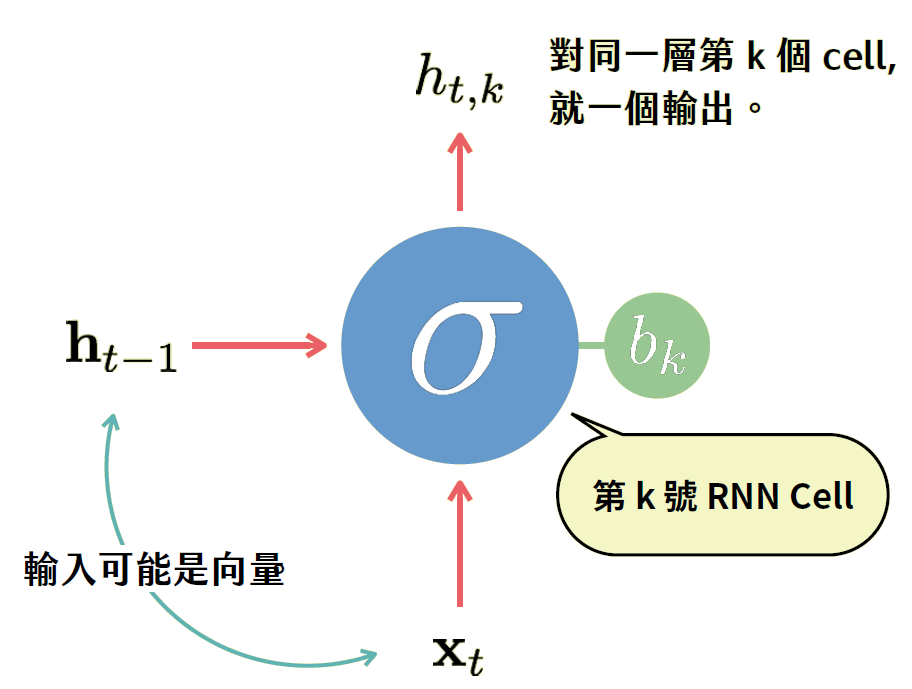

# 20190412 Python AI Math

[TOC]

> (今天要做的事情) 簡介基本的技術，比較仔細地推原理。

> 期中小專題不要拿正在研究的東西，拿生活周遭的問題來討論
> 要有實質的有趣，期末的問題也是差不多，也要是實際的問題(但不需要對趣味性這麼嚴苛)
> 不是所有的問題都是要用 Deep Learning 來做，但期末要(老師建議此周要開始思考期末專題主題)

## AI 核心技術 - 神經網路

"現在" 的主軸是深度學習(資料至少要上萬筆)，以前(1980-1990)也曾經紅過，但當時就死掉了，因為：

- 需要複雜的軟體
- 需要強大的電腦計算能力
- 需要大量的數據

> 一度沒有人做，甚至要搞研究計畫都不可能通過

Untill... [三巨頭的出現](bit.ly/ai_history) + Alpha Go

深度學習的模型只有三個(三層以上的神經網路被稱作深度學習)：

- NN (標準神經網路)
- CNN (卷積神經網路)
- RNN (記憶型神經網路)

其他的大多是這三種兜來兜去

### NN 標準神經網路

全稱：Fully Connected Neural Networks

(1980 當初就有的 model)

#### 神經元做甚麼

每個神經元都一樣的結構
$$
\varphi\left(\sum_{i=1}^n w_i x_i+b\right) = h
$$
$\varphi(x)$ 是 activation function，是用來讓線性之神經元能有不線性的行為，最早是用高斯函數(常態分配)，但因為計算上種種不便就取消了，目前大家最常用的就是 ReLU：
$$
\varphi(x)=\left\{\begin{matrix}
x, & x>c\\ 
0, & x\leq c
\end{matrix}\right.
$$

訓練之前需要給定 $\tilde{w}=(w_1,w_2,\dots,w_n), b$ (基本上隨機數)

#### NN 模型設計

- 有幾層 Hidden Layer
- 每層有幾個神經元
- 要用甚麼激發函數

#### 訓練模型 (Gradient Descent 法)

最"接近"的定義：loss function
$$
L(\theta)=\frac{1}{2}\sum_{i=1}^{n}\left\|y_i-F_\theta(x_i)\right\|^2
$$
走法：跟切線斜率相反(數理統計)，即：
$$
(\tilde{w}, b)-\eta \nabla L(\theta)
$$
Gradient Descent 的缺陷：可能走到局部極小，目前的解法是不同起點多走幾次。

### CNN 卷積神經網路

Convolution Neural Networks，主要做圖形辨識(但當初被 SVM 打敗)

特徵：

- Share weights: 權重(weights)大家都一樣
- filter: 每個神經元只輸入一部分的資料矩陣(但每個神經元輸入的部分不同)
- 大：(為了不忽略邊界值以及維持輸出大小跟輸入一樣大，有時會在邊界追加一層0值)

#### CNN 模型設計

- 每個 filter 的大小
- 要用幾個 filter

### RNN 遞迴神經網路

recurrent neural networks，主要是做對話機器人，要求資料必須有時間性

RNN 設計只要決定需要多少神經元

