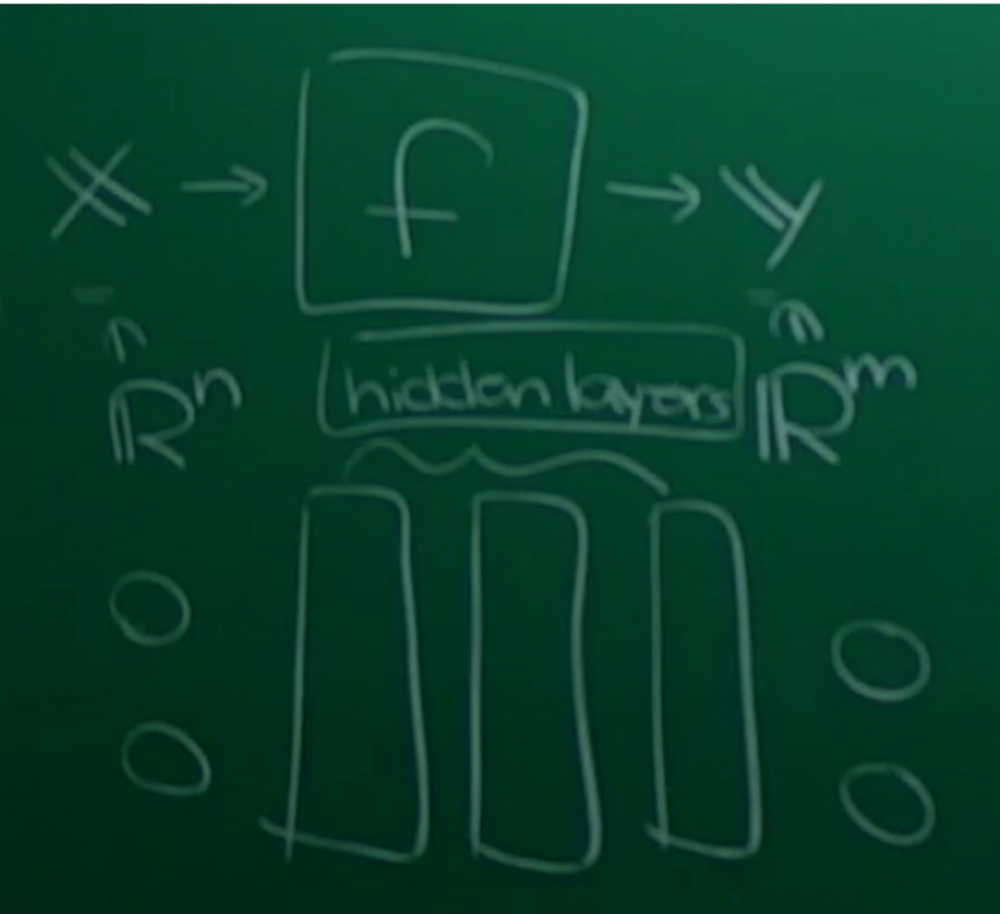

# 20190412 Python AI Math

[TOC]

> 這周作業基本上就是期末的主題公告

## NN

### Hidden Layer 的數學表達

假設我們今天討論 $f: \mathbb{R}^2 \rightarrow \mathbb{R}^3$ 一層 hidden layer，只生一個數字:
$$
\tilde{Y} = f(\tilde{X}) = (f_1(\tilde{X}),f_2(\tilde{X}),f_3(\tilde{X}))
$$
其實每個 $f_i: \mathbb{R}^2 \rightarrow \mathbb{R}$ ，其中:
$$
\tilde{X}=\begin{bmatrix}X_1\\X_2\end{bmatrix}
$$

Gradient Descent 的問題，模型太深你每層的 learning rate 會不斷相乘，可能會變成0也可能會爆掉，變成無法調整的狀態。

### Softmax

以手寫數字辨識為例(將圖片拆成 $28\times28$ 個區域輸入)，若輸出只是一維數字，我們如何知道是辨識成哪個數字(例如輸出0.5，是0與1之間的機率各半，還是其他組合)，所以我們會希望它輸出成 $\mathbb{R}^{10}$ 的向量表示每個數字分到的權重(One-Hot Encoding)

但有可能不是機率型式，所以我們還要做處理，而純平均也可能出事，目前最常用的方法是 Softmax:
$$
\alpha_i = \frac{e^{z_i}}{\sum e^{z_i}}
$$

#### [實作] 手寫辨識 MNIST

