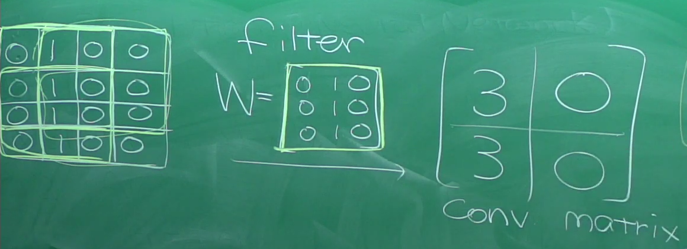
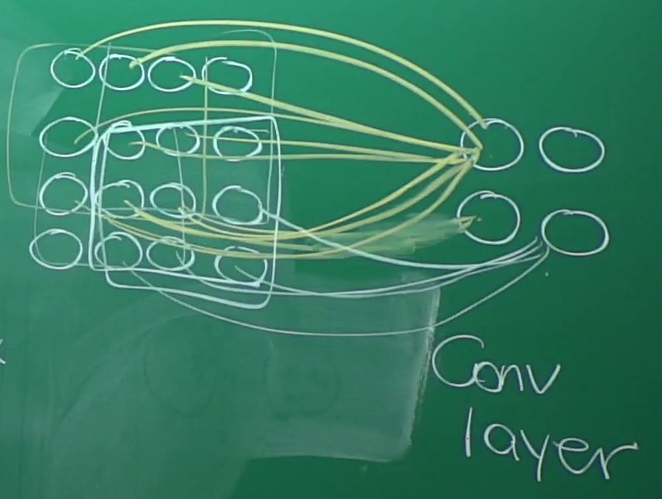
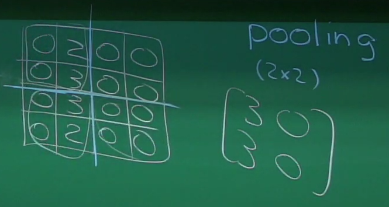
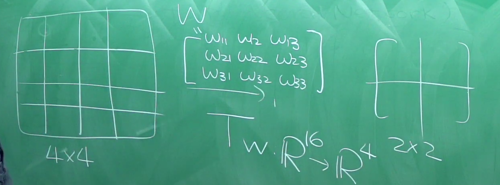

# CNN (Convolutional Neural Network)

>  Father or CNN: Yann LeCun (中譯：楊立昆) LeNet (1998)
>
> 主要做圖形辨識，非常主流的應用，停車場計費、保全畫面監視、無人駕駛辨識路況等...
>
> 一個方法在圖形辨識做得好，就會變得非常紅
>
> > LeNet 那篇論文其實連神經網路的名稱都不敢打出來，因為當時已經被 SVM 打敗
> >
> > 在上世紀 CNN 不紅是因為計算力不強
> >
> > 2012 AlexNet 用 CNN 拿到冠軍，之後的冠軍也幾戶都是 CNN
> >
> > 2014 VGG16/19, GooLeNet (Inception)[^1]
> >
> > 2015 ResNet

[^1]:  22 layers

## Conv

對應分區觀看辨識小物件的概念

- Filter: 通常越來越大

- conv matrix: filter 內積之後的結果

- conv layer: 整個對應關係稱之

  

## Pooling

有可能資料量會越來越多，(因為同一個值可能被掃很多次)，所以要分區取特徵值，叫 Pooling

## Tw

$Tw = C$

(Transpos convolution)

$f, w: \mathbb{R} \rightarrow \mathbb{R}$
$$
g(t) = (f\ast w)(t)=\int_{-\infty}^\infty f(\tau)w(t-\tau)d\tau
$$

