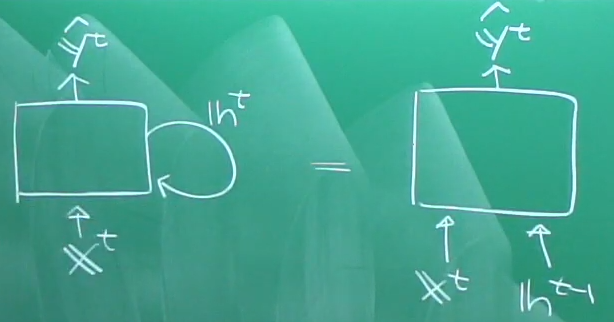
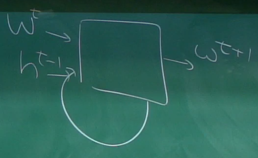
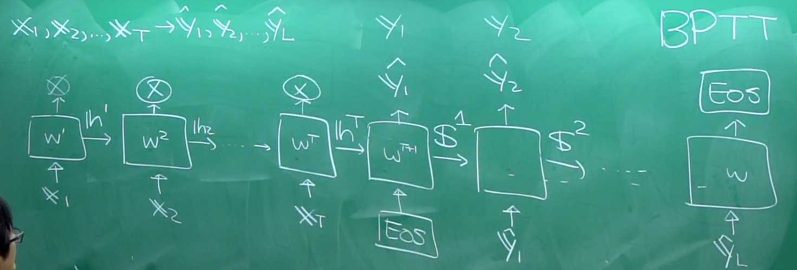
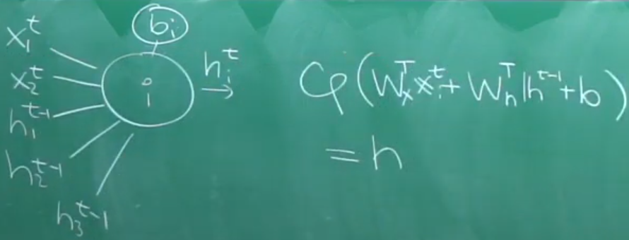
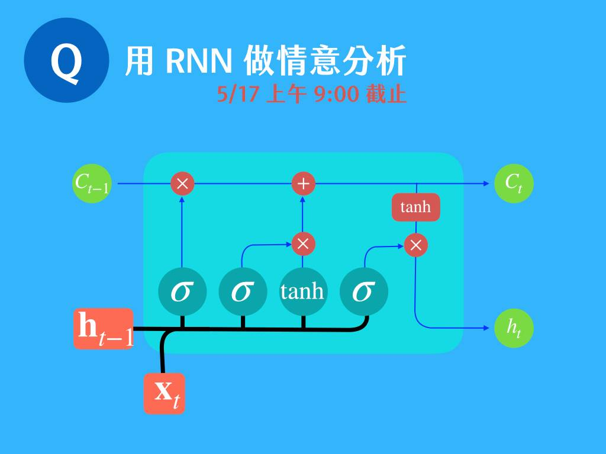
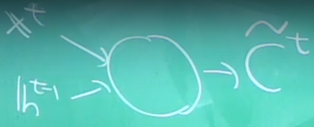
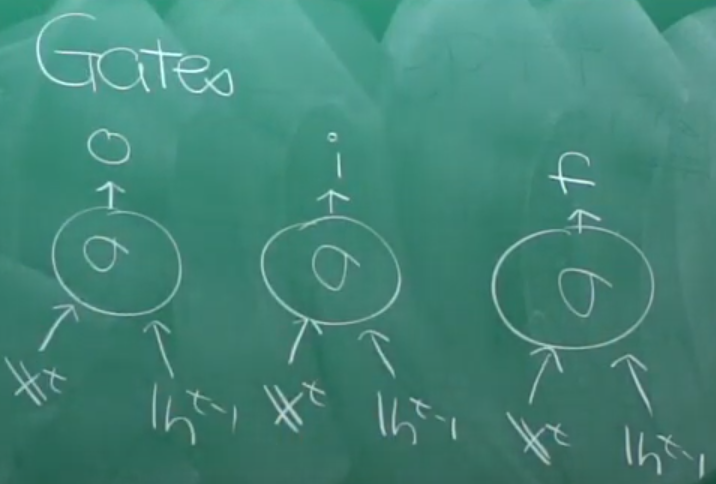

# RNN

## 基礎的 RNN：對話機器人

假如用 NN 會出什麼事？輸入不夠就會當機，所以我們的想法就是連續輸入生出一個值放回來：

這樣就是一個對話機器人，也可用來作其他用途：

那每個神經元長什麼樣？

問題是：這樣會變得非常複雜，很容易訓練失敗，於是有了 LSTM 跟 GRU

## LSTM

### 基本架構

$C_t = f C_{t-1}+i \tilde{C_t}$: Cell states，只留給自己用

$h_t = \theta \tanh\left(C_t\right)$: Hidden states，會分享給大家用

