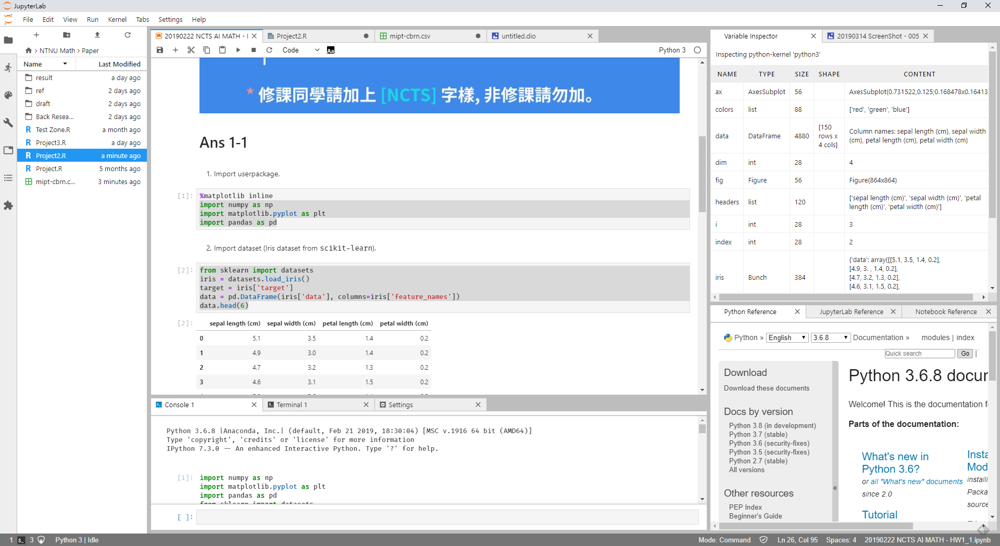
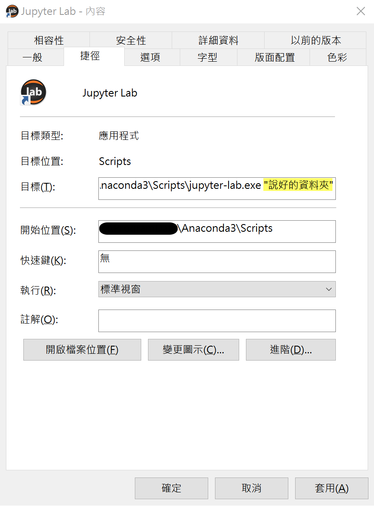
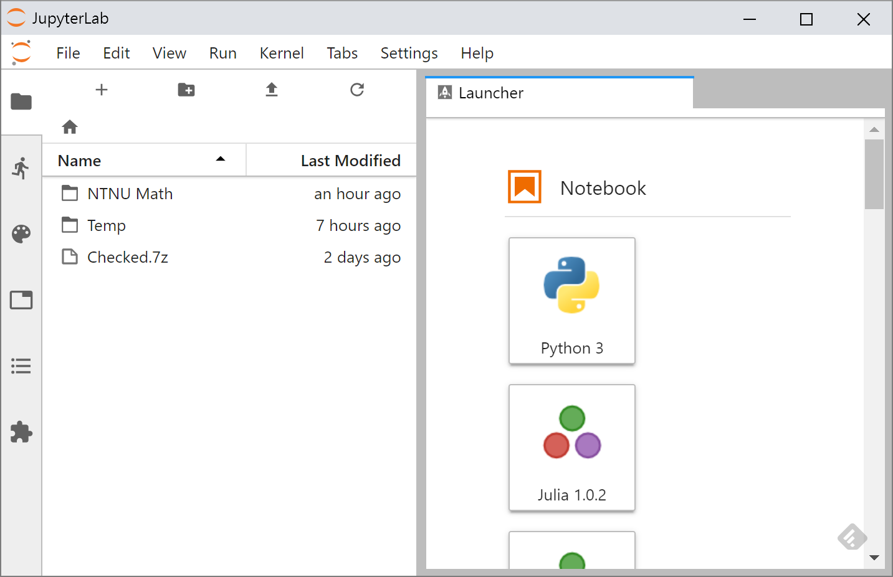
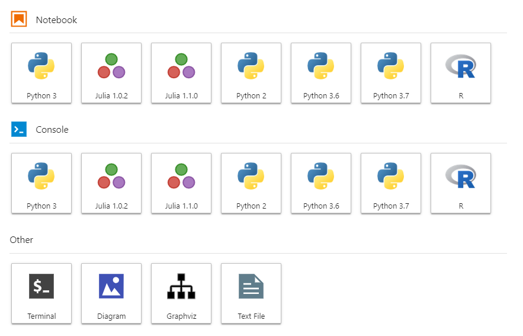
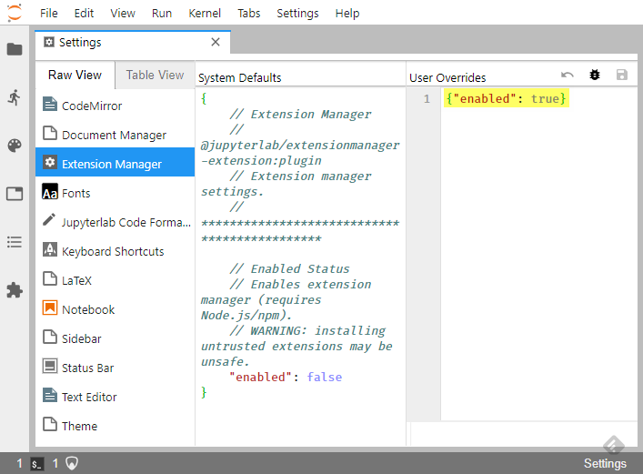
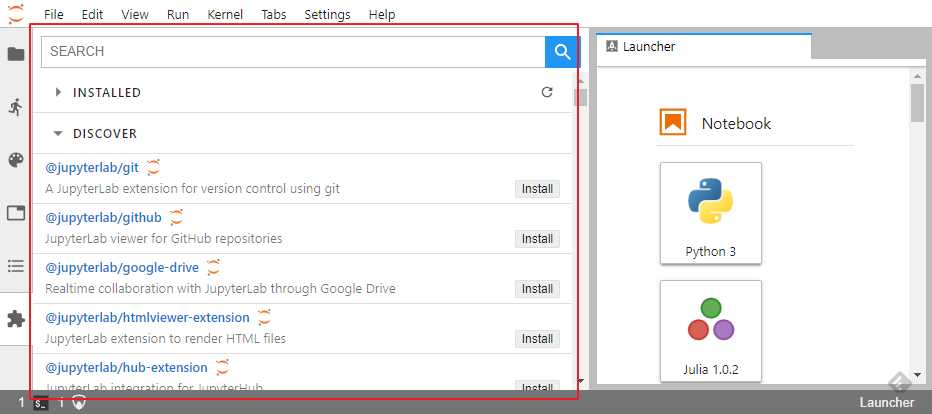
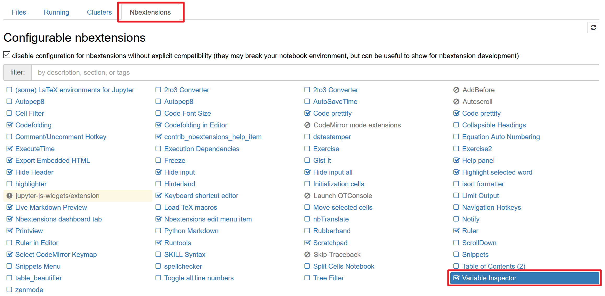

# JupyterLab 調整懶人包



---

## 啟動 JupyterLab

基本上高尚的大家應該要這樣開啟

```shell
cd "說好的資料夾"
jupyter lab
```

---

但我很懶怎麼辦？做捷徑(ICON [載點](https://github.com/jupyterlab/jupyterlab_app/blob/master/dist-resources/icon.ico))

```shell
...\Anaconda3\Scripts\jupyter-lab.exe “說好的資料夾”
```



---

## 更改 config

- 這樣還是會有醜醜的 URL 欄位，第一次建立 jupyter_notebook_config.py 檔案請使用命令

  ```shell
  jupyter notebook --generate-config
  ```

- 執行後會回報位置資料夾，請至資料夾開啟 jupyter_notebook_config.py 增加設定

  ```python
  c.NotebookApp.browser = ".../chrome.exe --app=%s"
  ```

---

- 這樣就賞心悅目了



---

- 之後有些外掛也可能要修改設定，大致上在以下五處

  1. `.../.jupyter/jupyter_notebook_config.py`
  2. `../.jupyter/custom/custom.js`
  3. (Lab跟Notebook共通)View 選單
  4. Lab 的 Setting 選單
  5. Lab 的 Advanced Settings (Ctrl+,)

---

## 多重 Kernel 安裝

Jupyter 支援多重 Kernel (可執行的語言核心)，加上 Anaconda 可以安裝虛擬版本的 Python 環境，所以我們的 Luncher 可以很壯觀：



---

### Python X.X.X/ X.X/ X

建立一個名叫 `py36` 的 Python 3.6 環境
加到 kernels 裡面叫做 `python3.6` 
平常使用時會顯示「Python 3.6」：

  ```shell
  # -n 是虛擬環境命名 python= 是指定版本號(可以3，可以3.6，可以3.6.8)
  conda create -n py36 python=3.6
  
  # 啟用環境 Windows 版
  activate py36
  # 啟用環境 Mac/Linux 版
  source activate py36
  
  # 在環境安裝 ipykernel
  pip install ipykernel
  # --name 後面接的是 kernels 命名 --display-name 後面接的是顯示名稱
  python -m ipykernel install --user --name python3.6 --display-name "Python   3.6"
  ```

---

#### 假如我們不想要了

```shell
jupyter kernelspec uninstall python3.6

# 假如不知道有那些 kernal 名稱用下面調來看
jupyter kernelspec list
# 假如連虛擬環境都不要
conda env remove --name py36
# 假如不知道有那些虛擬環境名稱用下面調來看
conda env list
```

---

### R Kernel

```R
R
install.packages('IRkernel',
                 repos = 'https://cloud.r-project.org/')
IRkernel::installspec(user = FALSE)
```

### Juila Kernel

```julia
julia
using Pkg
Pkg.add("IJulia")
```

---

## JupyterLab Extension Manager

Setting -> Advanced Settings (Ctrl+,) 開啟設定，在 Extension Manager 加入 `{"enabled": true}`



---

### 安裝 node.js

- 許多 Lab 的外掛都是用 node.js 或 npm 部屬，需要先安裝才能安裝外掛，Anaconda 可以用 conda 的方式安裝 node.js

  ```shell
  conda install nodejs
  ```

- 但上面的版本很舊，有些外掛會需要新版 node.js ，請至官網安裝最新的 LTS 版(長期支援版)

---

啟用 Extension Manager 之後就會出現這個介面



---

### 安裝外掛，以及要記得 Rebuild


1. 一般來說安裝外掛大致長這樣(不建議用剛剛的 Extension Manager 安裝)

   ```shell
   # 可能需要先透過 pip 或 conda 安裝其他東西
   jupyter labextension install 外掛名稱
   # 有些外掛會要求安裝後還有後續設定
   # 有些透過 npm 部屬
   npm i 外掛名稱
   ```

2. Rebuild JupyterLab

   ```shell
   jupyter lab build
   
   # 只有 jlpm 是例外
   jlpm build
   ```

---

## 有甚麼好 labextension 外掛?

- 美化程式碼：
  `@ryantam626/jupyterlab_code_formatter` (須配合 Python Package `black`/`yapf`/`autopep8` 三者至少一個)

- 變數監看：
  `@lckr/jupyterlab_variableinspector`

- 自定義字體：
  `@deathbeds/jupyterlab-fonts`
  (搭配 `@deathbeds/jupyterlab-font-fira-code`)

---

- Open .md With Notebook：
  `notedown`(非 labextension)

- 支援 `ipywidgets`：
  `@jupyter-widgets/jupyterlab-manager`

- 表格瀏覽：`jupyterlab-spreadsheet`
- draw.io：`jupyterlab-drawio`
- 目錄表：`@jupyterlab/toc`
- 狀態列：`@jupyterlab/statusbar`

---

## 展望：JupyterLab 1.0 版可能翻案

- 官方說 1.0 版 2018 年底會出來，目前 alpha3 版，github 上顯示完成度約 88%。

- 更壞的消息，官方宣稱未來 JupyterLab 1.0 會取代現在的 Jupyter Notebook 。

- 不過官方承諾應該會讓大多數 Jupyter Notebook 的外掛可以安裝於 JupyterLab 。

---

## Notebook 的外掛大補帖

- 安裝 jupyter_contrib_nbextensions

```sh
conda install -c conda-forge jupyter_contrib_nbextensions
```

- 之後進 Jupyter Notebook 設定即可



---

## 小結語：幾乎功能完整的 IDE


